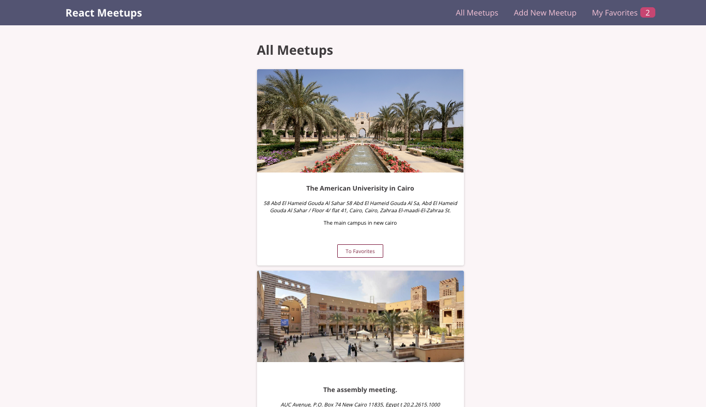
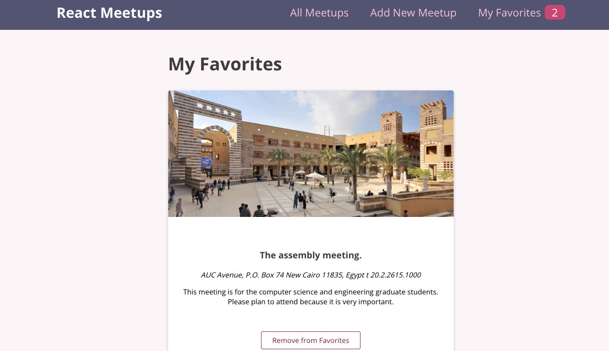

# Meetup app

## Introduction

>This is an web app to track the varites meetings attended at school.


## Objective

> The object is to create the application that will list the meetups add them into the database, and fecth favatites ones. 

## Requirements

> React 

> Firebase Realtime Database


## Install

> npx create app react

### Installing this application

### How to use
First perform the following code: 
``` npx create-react-app meetup_list
cd meetup_list
npm start

```

- First clone this repo to your local machine using the command below

```
https://github.com/niyotham/react-crash-course-code.git
cd meetup_list
npm start
npm install
```

## Examples

> ### Using this application locally

- One can start using the application by first running the front and back ends.
- You can run the front-end by running the following command on the terminal
- A more detailed instruction regarding the front-end can be found at presentation/readme.md file.

```
cd presentation
npm run start
```

- You can run the back-end by running the following command on the terminal

```
https://github.com/niyotham/react-crash-course-code.git
cd api
uvicorn app:app --reload
```

> ### Interacting with the front end

- After running the front end, one can simply go over to the browser and type in [http://localhost:3000](http://localhost:3000). or click this [link](http://localhost:3000)
- A page similar to this will appear.



- review the results of the  favorites meeting  and the list of the meeting 
-





## Authors


> 👤 **Niyomukiza Thamar**
>
> - [Email](mailto:thamarniyo@gmail.com), [GitHub](https://github.com/niyotham), [LinkedIn](https://www.linkedin.com/in/thamar-niyomukiza-230959125/)

